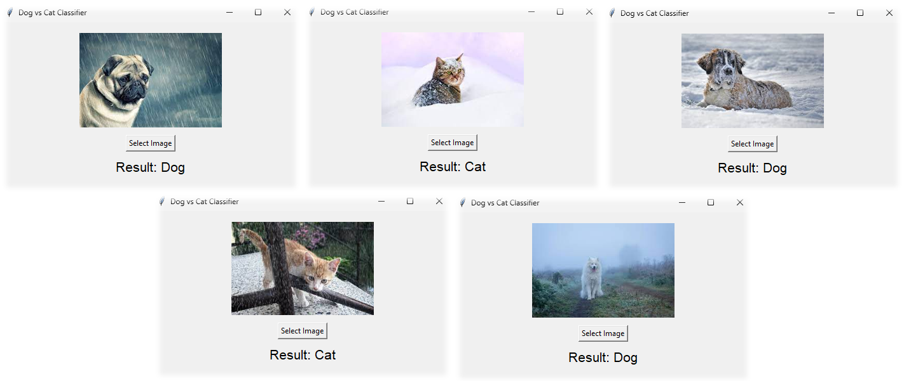

# 🐾 Weather-Proof Pet Detection: A Desktop Application
#### 🌦️ A Comprehensive Solution Leveraging Transfer Learning, Data Augmentation, and Desktop Deployment


## 📖 Overview
Welcome to our project repository, showcasing a robust and efficient model for distinguishing between dogs and cats, adaptable to various weather conditions and deployed as a desktop application using the Tkinter library. Our journey involved extensive data exploration, transfer learning with advanced models, and the development of a user-friendly desktop application.

## ❓ Problem Statement
Our mission was to develop a desktop application capable of accurately identifying dogs and cats in diverse weather scenarios. We aimed for high accuracy while ensuring the model's efficiency and adaptability, integrating cutting-edge models and innovative approaches, including a Tkinter-based user interface.

## 🎯 Objectives
The key milestones in our project included:
* **Dataset Exploration:** Analyzing the balanced dataset of dogs and cats images.
* **Weather Simulation:** Incorporating varied weather effects to enhance model robustness.
* **Data Augmentation:** Broadening our dataset to improve model generalization.
* **Transfer Learning:** Adapting advanced models and experimenting with SVM classifiers.
* **Model Evaluation:** Assessing accuracy and size benchmarks.
* **Model Selection:** Choosing the best model for practicality and performance in our desktop app.
* **Desktop App Development:** Creating a user-friendly desktop application using Tkinter.

## 📚 Dataset Description
We utilized a dataset of 25,000 color images of dogs and cats, balanced to provide a solid foundation for our model. Access the dataset [here](https://www.kaggle.com/competitions/dogs-vs-cats/data).

## 📁 File Descriptions
- **`WeatherProof_Pet_Detection.ipynb`**: The Jupyter notebook detailing our journey from data prep to model evaluation.
- **`model/mobilenetv2_nn_model.h5`**: The trained model, ready for deployment.
- **`app.py`**: The desktop application script using Tkinter for the pet detection system.
- **`test_images/`**: Test images showcasing the model's generalization capability.
- **`requirements.txt`**: List of dependencies for the desktop app.

## 🚀 Getting Started

### Exploring the Model Development Pipeline
To review the model development process:
1. Clone this repository to your local machine.
2. Open `WeatherProof_Pet_Detection.ipynb` in Jupyter to review the complete process from data preparation to model training.

### Setting Up the Environment and Dependencies
To set up the environment and run the desktop application, follow these steps:
1. Open your terminal or command prompt.
2. Create a new Python environment (ensure you have Python 3.9 installed):
    ```bash
    python -m venv weatherproof-pet-env
    ```
3. Activate the environment:
    - On Windows:
      ```bash
      weatherproof-pet-env\Scripts\activate
      ```
    - On macOS and Linux:
      ```bash
      source weatherproof-pet-env/bin/activate
      ```
4. Navigate to the project directory where `requirements.txt` is located:
    ```bash
    cd path/to/your/project
    ```
5. Install the required dependencies:
    ```bash
    pip install -r requirements.txt
    ```

### Running the Desktop Application
To run the desktop app:
1. Ensure the environment is activated and you are in the project directory.
2. Run the application:
    ```bash
    python app.py
    ```
3. The application window will open, allowing you to upload images and test the model's performance under different weather conditions.

Remember to deactivate the virtual environment when you're done:
```bash
deactivate
```

### 📸 App Performance Showcase with Test Images



## 🔗 Additional Resources
- 🌐 **Kaggle Notebook**: Explore model development process on Kaggle [here](https://www.kaggle.com/code/farzadnekouei/weather-proof-pet-detection-app).
- 🤝 **Connect on LinkedIn**: For questions or collaborations, connect on [LinkedIn](https://linkedin.com/in/farzad-nekouei-7535aa53/).

